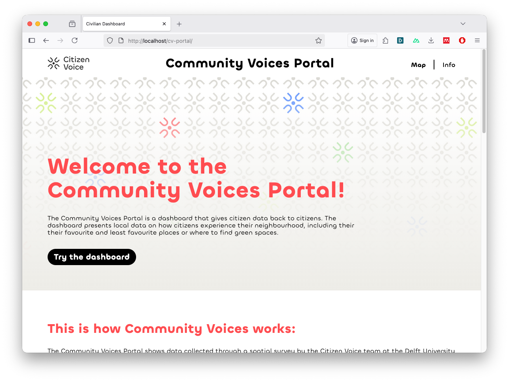
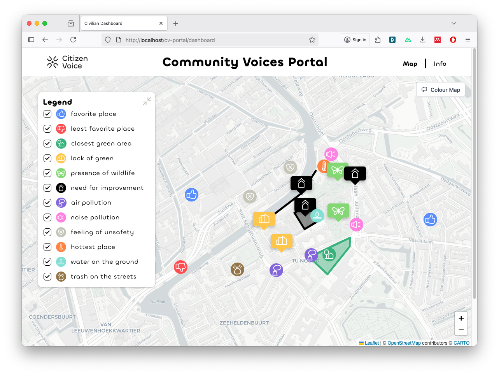

# Community Dashboard

A front end application that allows user to visualize answers to geospatial questions. 



## Tech Stack

- [NodeJS](https://nodejs.org/docs/latest/api/)
- [NuxtJS 3](https://nuxt.com/docs/getting-started/installation)
- [Pinia](https://pinia.vuejs.org/)
- [Vue](https://vuejs.org/)
- [LeafletJS](https://leafletjs.com/)

## Associated APIs

- [Civilian API](./apis.md)

## Running the App in Development

1. Install the dependencies.

```shell
cd cv-portal/
yarn install
```

2. Rund the App.

```shell
yarn run dev

# Press CTRL + C to stop the app
```

## Bugs and Issues

To report bugs and request new features, please use the [Citizen Voice Issue Tracker](https://github.com/Citizens-Collective/Citizen-Voice/issues).