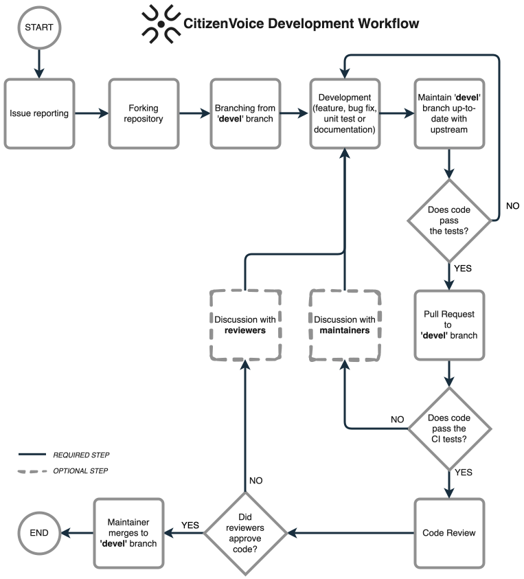

# Development Workflow

Communication and collaboration are key to the success of the Citizen Voice project. This document outlines the development workflow to ensure smooth collaboration among team members.

Both team members and external contributors are expected to follow this workflow when contributing code to the Citizen Voice project.

## Coding standards

The are no strict coding standards for the Citizen Voice project. However, we recommend following best practices for the programming languages and frameworks used in the project.

## Version Control

We use Git for version control. Please follow these guidelines when contributing to the project:

- Create a fork of the repository for your changes.
- Create a new branch for each feature or bug fix.
- Write clear and concise commit messages.
- Submit pull requests for review before merging changes into the `devel` branch.
- Write tests for new features and bug fixes.
- Write documentation for new features and changes to existing features.

## Code Reviews

All code changes must be reviewed by at least one other team member before being merged into the `devel` branch. Code reviews should focus on code quality, adherence to coding standards, and overall functionality.
