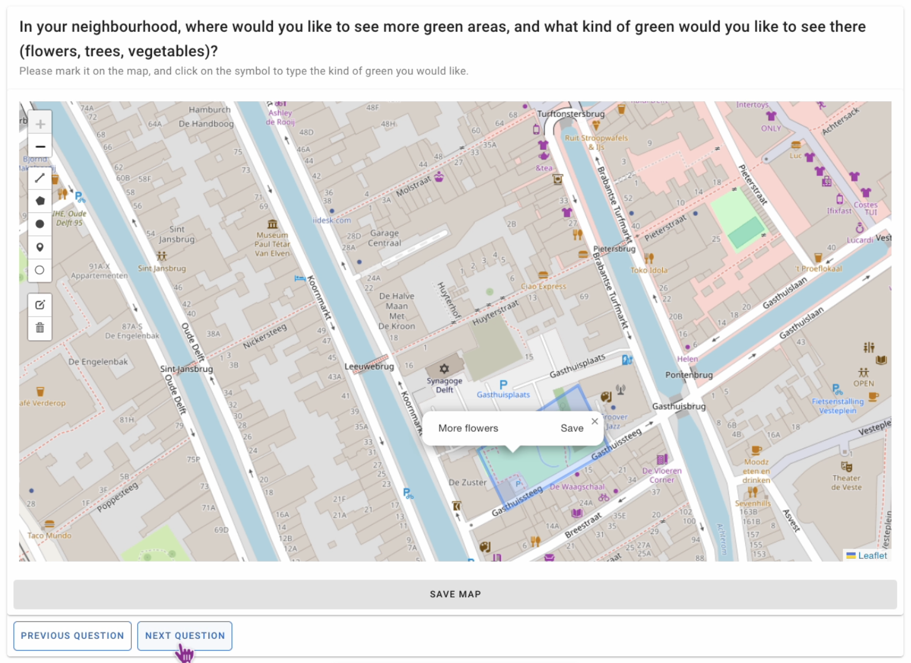

# Overview

The Citizen Mapping Tool is an open-source map-based tool to collect data from citizens and other local actors. The tool allows for conventional types of survey questions, such as multiple choice, and map-based questions, including the possibility of add pins and draw polygons on a map.

  <!---
   **What problems does CitizenVoice solve?**
  - **What can you do with CitizenVoice?**
  - **What are its limitations?**
  -->