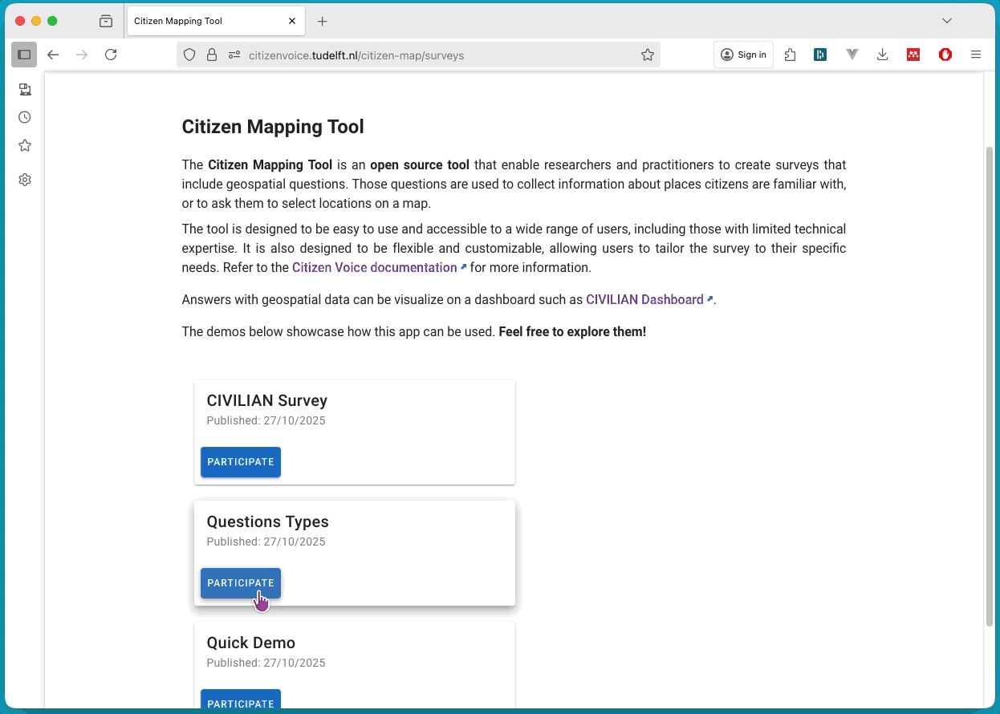

# Overview

The Citizen Mapping Tool is an open-source map-based tool to collect data from citizens and other local actors. The tool allows for conventional types of survey questions, such as multiple choice, and map-based questions, including the possibility of add pins and draw polygons on a map.

## About Us

Citizen Voice aims to empower communities for inclusive and meaningful participation in urban planning and design. Advocating for situated engagement approaches over one-size-fits-all solutions, Citizen Voice develops creative transdisciplinary methods and tools (like the *Citizen Mapping tool*) to capture perspectives often overlooked in traditional urban data. Visit the [Citizen Voice website](https://citizenvoice.tudelft.nl/) to learn more about our work and team.

