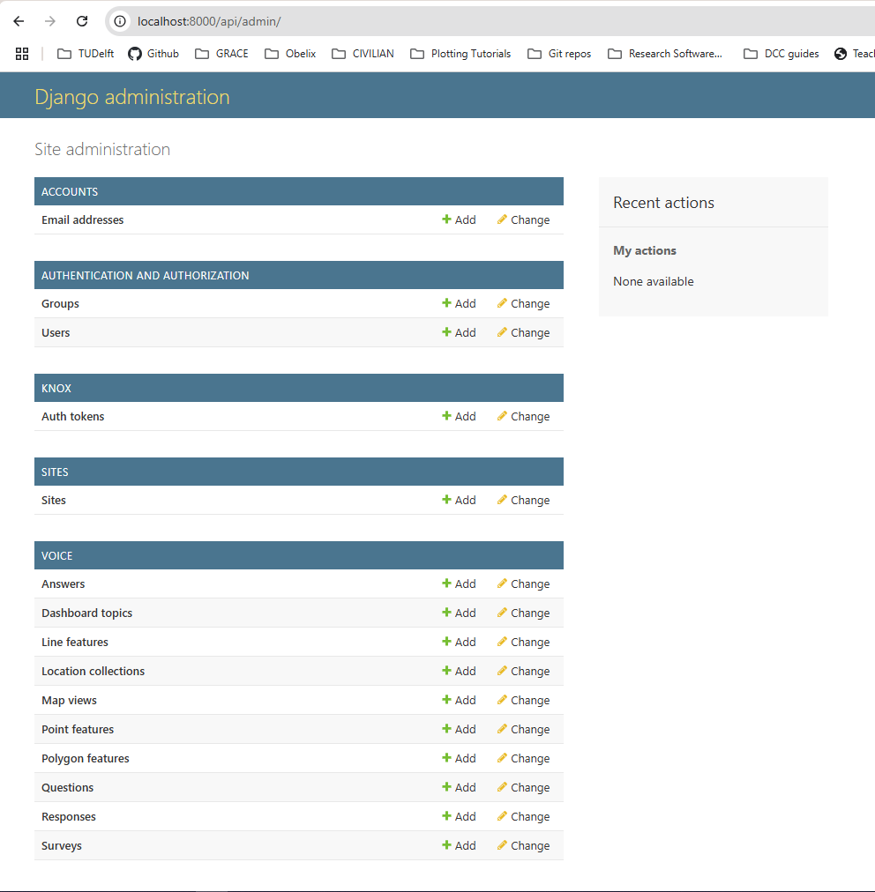
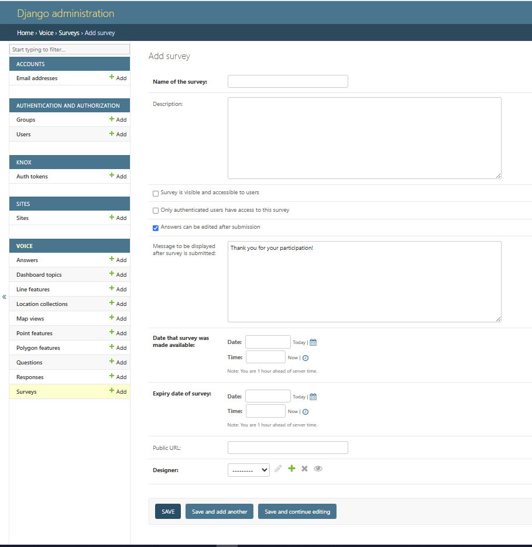
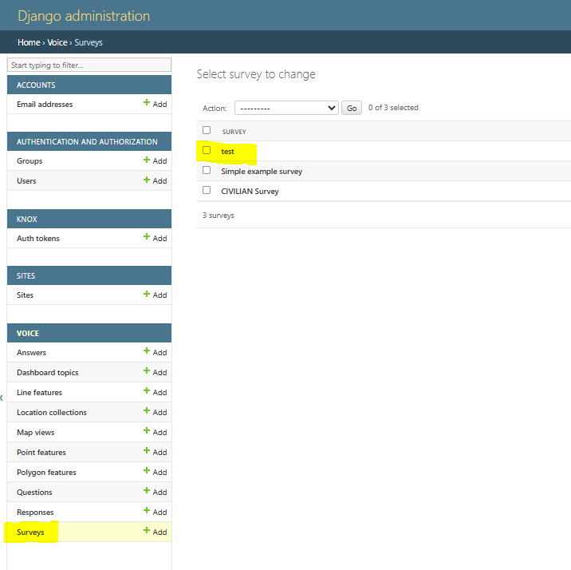
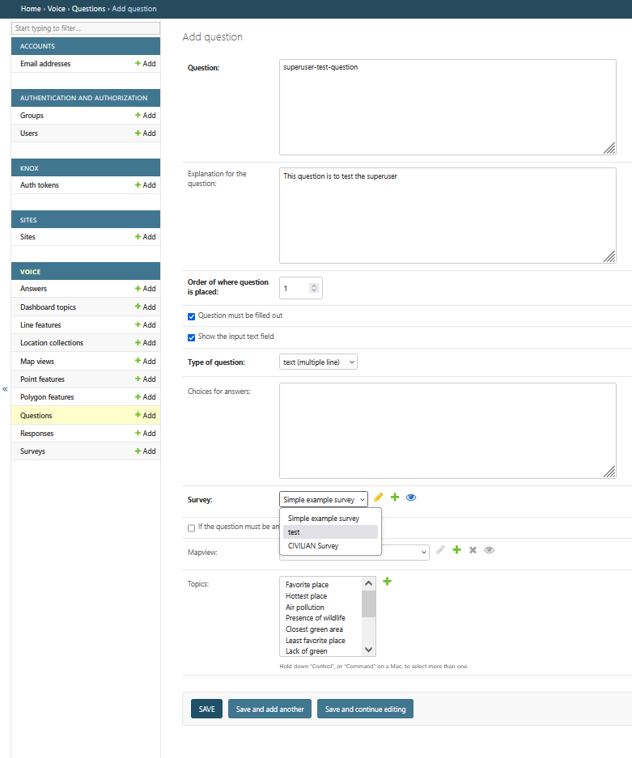
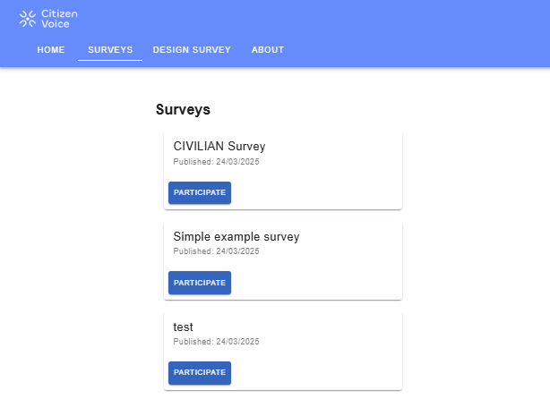

# Creating Surveys

Citizen Mapping tool is an open-source map-based tool to collect data from citizens and other local actors. The tool allows for conventional types of survey questions, such as multiple choice, and *map-based* questions, including the possibility to add pins and draw polygons and lines on a map. It also allows to upload images. 

Map-based questions can be including as part of coventional questions. This means that a questions can as a participant to pick a choice from a list of answers, and also draw pins on a map, for example. This flexibility, enables practioners to design questions that match their survey goals.

## Common Question Types

| Question Type   | Purpose                                                                        |
| --------------- | ------------------------------------------------------------------------------ |
| Short text      | For questions requiring a single line of text.                                 |
| Long text       | For questions requiring multiple lines of text.                                |
| Single choice   | For single choice question. Respondents pick one of the given answers.         |
| Multiple choice | For multiple choice question. Respondents pick one or more given answers.      |
| Number int      | For questions requiring a number **without** decimals as answer.               |
| Number float    | For questions requiring a number **with** decimals as answer.                  |
| Date            | For questions requiring a valid date as answer.                                |
| Image upload    | For questions requiring to upload an image.                                    |
| Likert scale    | For questions that use a Likert scale. Scales can contains from 3 to 10 steps. |

## Special Question Types

```{tip}
**Geospatial:** for questions requiring to draw points, lines or polygons on a map. Annotations can be added to every drawing. 
*This type can be combined with other question types* with the exception of the `long text` type. In the current implementation, 
a text field will not be shown if this combination is chosen. The `short text` type can be used instead.
```

The best approach to create such a survey(s) for your own projects is to run the application in a Docker container and create a superuser.

## Logging in as a Superuser in the Django Administration

These steps will walk you through to create a superuser for the Django application running inside the Docker container.

### Prerequisites

- Docker and Docker Compose (version 2.22.0 or later) installed on your machine.
- The containers for this app must be running. See the [installation guide.](./installation.md)

### 1. Access the Docker Container

First, you need to access the Docker container where your Django application is running. Open your terminal and execute the following command:

```bash
docker compose exec django-api /bin/bash
```
**Warning:** If you encounter an error stating that `/bin/bash` is not found, your container might be using a different shell. Try using `/bin/sh` instead.

(step-2-create-a-superuser)=
### 2. Create a Superuser

Once you are inside the container, use Django's `createsuperuser management` command to create a superuser:
```bash
python manage.py createsuperuser
```
Follow the prompts to enter a username, email address, and password for the superuser.

### 3. Access the Django Admin Interface
After creating the superuser, you can access the Django admin interface by navigating to `http://localhost/api/admin` in your web browser. Use the credentials you set up in the previous step to log in.

#### Troubleshooting
**Verify Container Status:** Ensure that the container is running. You can check the status of your containers with:

```bash
# On the Citizen-Voice/
docker compose ps
```
By following these steps, you should be able to create a superuser and access the Django admin interface in your Dockerized Django application.

## Creating a Survey as a Superuser in Django Administration

### 1. Access the Docker Container

1. Once you're in the repository, run `docker-compose --env-file .env up --build` to go to the local administrator page.
2. Log in using your credentials created in [Step 2: Create a Superuser](#step-2-create-a-superuser)
3. Upon successful login, you will see the Django administration dashboard as shown below:



### 2. Create a New Survey

   1. In the "VOICE" section, click on the `+ Add` button next to "Surveys" to create a new survey.

   2. You will be redirected to the "Add survey" page where you can input the survey details such as name, description, visibility settings, and active days.




   3. Fill in all the required fields:
      <br><br>
         - Name of the survey: Enter a descriptive name for your survey.
         - Description: Provide a brief description of the survey.
         - Visibility and Access: Configure who can see and access the survey.
         - Active Days: Set the duration for which the survey will be active.
         - Message to be displayed after submission: Customize the thank you message.
         - Public URL: Optionally, set a public URL for the survey.
         - Designer: Selec the user this survey belongs to 
      <br> <br>
   4. Once all the information is entered, click the `Save` button to create the survey.

### 3. Verify Survey Creation

1. After saving, your survey will be listed in the "Surveys" section.

2. You can verify the creation by checking the surveys list, where your new survey should appear.



### 4. Add Questions to the Survey

1. To add questions to your newly created survey, navigate to the "Questions" section and click the `+ Add` button.

2. On the "Add question" page, fill in the question details such as the question text, explanation, and type of question.
   


1. Link the question to your survey by selecting the survey name from the "Survey" dropdown menu.

2. After entering all the details, click the `Save` button to add the question to the survey.

3. Repeat this process to add all the questions that belong to the survey.

### 5. Finalize and Review

Once all questions are added, navigate back to the surveys list to ensure everything is set up correctly.
Your survey is now ready and accessible under the "Surveys" tab in your running instance of the Citizen Mapping App.
Go to [http://localhost/citizen-map/surveys/](http://localhost/citizen-map/surveys/) on your web browser.



After completing the survey setup, log out from the superuser account to secure your session.

By following these steps, you can successfully create and manage surveys using the Django administration interface.
